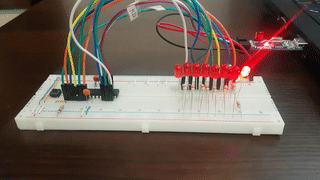

# AVR ATmega8 cookbook

## Software requirements
Install libraries required for AVR programming, compiling and deploying
``` 
sudo apt install gcc gcc-avr avr-libc binutils-avr avrdude
```

You will also need any text editor or your favourite IDE

## Example codes
### 00_test
Basic configuration with one blinking LED to test your environment
### 01_led-binary-timer
Simple binary counter with 8 LEDs display


### 02_led-wave
Make wave with 8 LEDs (same scheme as 01_led-binary-timer)



### 03_lcd-hd44780
Initialization and usage of liquid-crystal display HD44780 with FizzBuzz as example

## Compiling and programming the ATmega8
There is `deploy.sh` script in every example directory that does all the work:
```
# Compile code to Executable and Linkable Format  
sudo avr-gcc -mmcu=atmega8 main.c -o main.elf
# Copy ELF file into a new Intel HEX format file
sudo avr-objcopy -O ihex main.elf main.hex
# Program main.hex into the microcontroller
sudo avrdude -c usbasp -p m8 -U flash:w:main.hex
```
